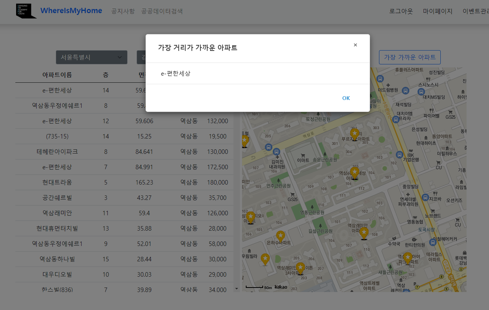
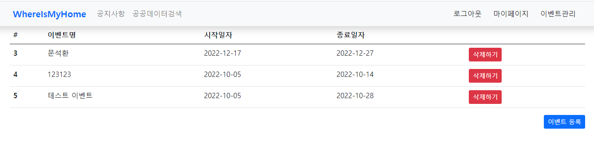
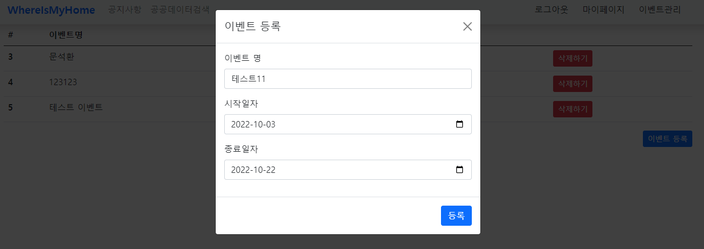
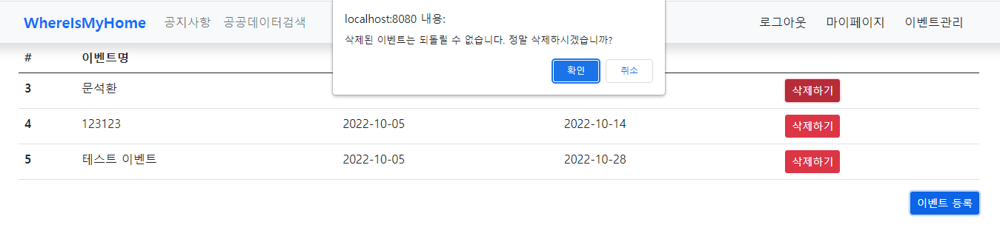
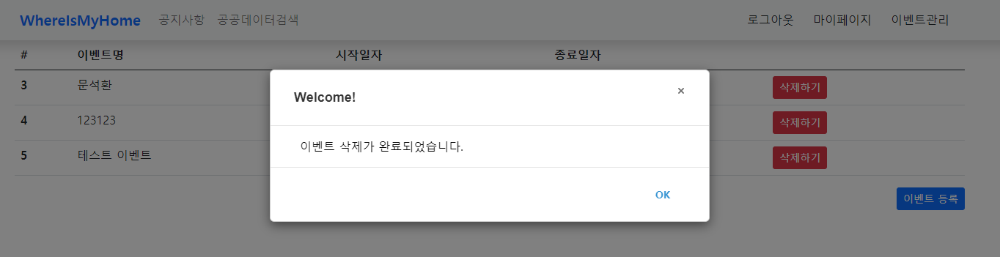

# WhereIsMyHome_5_Algo_11조_김송빈_배충현

## 1. HTML
- index.html
- eventList.html
 

## 2. Packages & Java files

|Package|Package|Java file|
|----|:---:|-----|
|admin||AdminInterceptor|
|common||LoginInterceptor|
|config||WebMvcConfig|
|controller||HomeController|
|event|dto|EventDto   EventResultDto|
|event||EventController   EventDao   EventService   EventServiceImpl|
|house|dto|HousetDto   HouseResultDto   PlaceDto|
|house||HouseController   HouseDao   HouseService   HouseServiceImpl|
|user|dto|UserDto   UserResultDto|
|user||UserController   UserDao   UserService   UserServiceImpl|

 

## 기능 List
- 1. 메인 화면
- 2. 실거래가 검색, 결과
- 3. 회원 관리
- 4. 공통코드 추가
- 5. 로그인/로그아웃
- 6. 공공데이터 검색
- 7. db

## 기능 1. 알고리즘

### 1-1. 현재 위치에서 가장 가까운 거리의 아파트 검색

## 기능 2. Event 관리자 페이지

### 2-1. Event 리스트

### 2-2. Event 등록

### 2-3. Event 삭제

 

